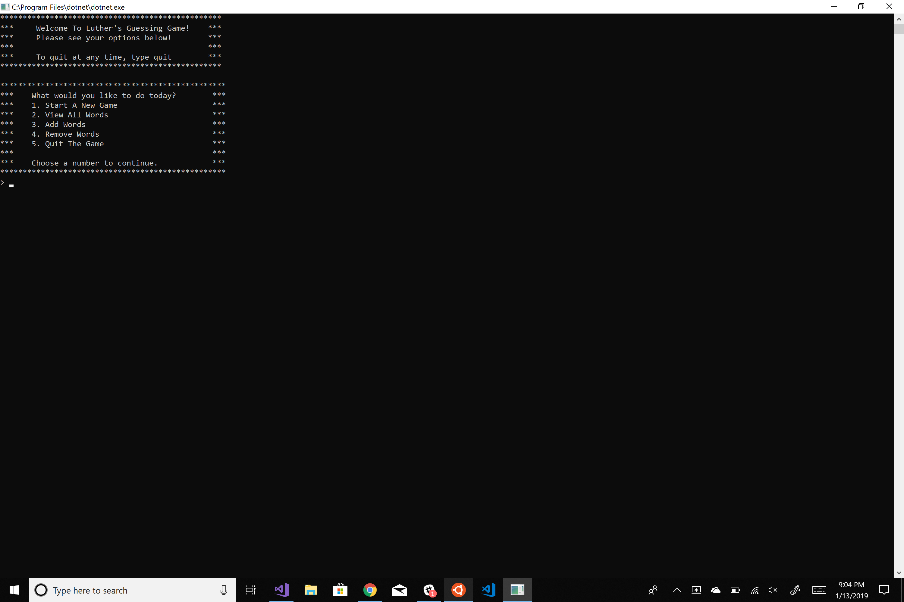

# WordGuessGame
This application is teaching us about System.IO and how to read and write to and from files, as well as teaching us the importance of methods and testing using xUnit. 

## Application View

## Get Started
Do you wan't to view this application on your computer? Fork or clone my project into Visual Studio and then click the Green Start button.

## Contributing
Have any ideas that you would like to add, or bugs that you want to fix. Feel free to send in a pull request.

## License
This project is licensed under the MIT license.
